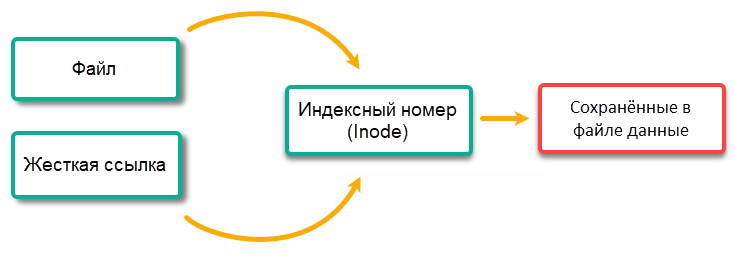
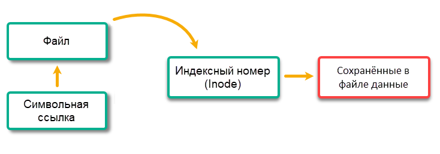

## Оглавление <a id="title"></a>
</a> <p align="right"> <a href="0.0_Оглавление.md#title">Общее оглавление</a> </p>

+ 3.0 [Структура файловой системы (FHS)](#t_3.0)
  + 3.1 [Базовые команды навигации в файловой системе](#t_3.1)
    + 3.1.1 [pwd [print working directory]](#t_3.1.1)
    + 3.1.2 [cd [change directory]](#t_3.1.2)
    + 3.1.3 [ls [list directory content]](#t_3.1.3)
  + 3.2 [Создание и удаление файлов и директорий](#t_3.2)
    + 3.2.1 [mkdir [make directory]](#t_3.2.1)
    + 3.2.2 [touch [change file timestamps]](#t_3.2.2)
    + 3.2.3 [rm [remove]](#t_3.2.3)
    + 3.2.4 [rmdir [remove empty directories]](#t_3.2.4)
  + 3.3 [Просмотр текстовых файлов](#t_3.3)
    + 3.3.1 [cat []](#t_3.3.1)
    + 3.3.2 [more [display file content page by page]](#t_3.3.2)
    + 3.3.3 [less [] ](#t_3.3.3)
    + 3.3.4 [nano []](#t_3.3.4)
    + 3.3.5 [wc [word count]](#t_3.3.5)
    + 3.3.6 [nl [number lines]](#t_3.3.6)
    + 3.3.7 [vim](#t_3.3.7)
  + 3.4 [Перемещение и копирование файлов и директорий](#t_3.4)
    + 3.4.1 [cp [copy]](#t_3.4.1)
    + 3.4.2 [mv [move]](#t_3.4.2)
  + 3.5 [Как хранятся файлы на диске](#t_3.5)
  + 3.6 [Жесткая ссылка (Hard link)](#t_3.6)
  + 3.7 [Символьная ссылка (Symbolic link)](#t_3.7)
  + 3.8 [ln [make links between files]](#t_3.8)
  + 3.9 [Отличия жестких и мягких ссылок](#t_3.9)
    + 3.9.1 [Жесткие ссылки](#t_3.9.1)
    + 3.9.2 [Мягкие ссылки](#t_3.9.2)
    + 3.9.3 [Удаление ссылок](#t_3.9.3)
  + 3.10 [Архивация и сжатие (tar, gzip)](#t_3.10)
    + 3.10.1 [tar [tape archive]](#t_3.10.1)
  + 3.11 [Утилиты сжатия](#t_3.11)
    + 3.11.1 [gzip [GNU zip]](#t_3.11.1)
    + 3.11.2 [bzip2 [Burrows-Wheeler block sorting text compressor]](#t_3.11.2)
    + 3.11.3 [xz [XZ Utils compression]](#t_3.11.3)

## Структура файловой системы (FHS) <a id="t_3.0"></a>
Структура файловой иерархии Linux, также известная как Filesystem Hierarchy Standard (FHS), определяет организацию каталогов и их содержимое в операционных системах, подобных Unix. За поддержание стандарта отвечает организация Linux Foundation.  

+ Согласно FHS, все файлы и каталоги располагаются внутри корневого каталога `/`, даже если физически или виртуально они находятся на разных устройствах.  

+ Некоторые из этих каталогов присутствуют в системе только при наличии определённых подсистем, например X Window System.  

+ Большинство из этих каталогов встречаются во всех UNIX-подобных системах и используются примерно одинаково, однако описания, приведённые здесь, актуальны именно для FHS и не считаются авторитетными для платформ, отличных от Linux.  

Все пути в Linux начинаются с корневой директории `/`  
Для перехода из любой директории в директорию пользователя `cd ~`  
Для перехода в другую директорию есть 2 способа:  
Абсолютный путь (от корневой директории) `/home/tolkonepclaptop/Downloads/test/`  
Относительный путь (от текущей директории) `Downloads/test/` 

| Каталог        | Назначение                     | Примечания| 
|:---------------|:--------------------------------------|--|
| /              | Корень всей файловой системы.                                                                                             | От него «ответвляются» все остальные каталоги.
| /bin           | Основные бинарные файлы, необходимые для загрузки и работы системы в однопользовательском режиме.                         | В современных системах — символическая ссылка на /usr/bin.
| /sbin          | Системные бинарные файлы — утилиты для администрирования, восстановления, загрузки и отката системы.                      | Также часто ссылается на /usr/sbin.
| /etc           | Конфигурационные файлы системы и приложений (настройки сети, пользователей, служб).                                       | Не содержит исполняемых файлов.
| /home          | Домашние каталоги обычных пользователей. Каждый пользователь имеет доступ только к своему каталогу.                       | Многопользовательская среда.
| /root          | Домашний каталог суперпользователя (root).                                                                                | Доступен только root.
| /boot          | Статические файлы загрузчика: ядро (vmlinuz), образ initrd, конфигурации GRUB и другие файлы, необходимые для запуска ПК. | Обычно это отдельный раздел.
| /lib           | Библиотеки (разделяемые файлы), необходимые для работы программ из /bin и /sbin.                                          | /lib64 для 64-битных библиотек, /lib32 – для 32-битных. В современных системах – симлинки на /usr/lib и т.д.
| /opt           | «Необязательное» место для установки стороннего (ручного) ПО, которое не входит в базовую поставку системы.               | Например, программы, устанавливаемые из архивов .tar.gz.
| /usr           | Иерархия пользовательских приложений и данных. Содержит исполняемые файлы, библиотеки, документацию и исходники.          | Основное хранилище для программ, доступных пользователям.
| ↳ /usr/bin     | Большинство исполняемых команд (бинарные файлы) для пользователей.                                                        | Основное место для команд.
| ↳ /usr/sbin    | Системные утилиты для задач, выполняющихся многократно (не критичных для начальной загрузки).                             | 
| ↳ /usr/lib     | Библиотеки для программ из /usr/bin и /usr/sbin.                                                                          | 
| ↳ /usr/include | Заголовочные файлы (header files) для компиляции исходного кода.                                                          | Используются разработчиками.
| ↳ /usr/share   | Архитектурно-независимые данные: документация, иконки, шрифты, справочные страницы и т.д.                                 | Общие для всех систем.
| ↳ /usr/src     | Исходные тексты ядра Linux и другие исходники (например, драйверов).                                                      | Часто содержит исходный код ядра.
| ↳ /usr/local   | Программы и библиотеки, устанавливаемые локально (не через менеджер пакетов).                                             | По структуре повторяет /usr.
| /var           | Переменные (часто меняющиеся) данные: системные логи, очереди печати, кэши пакетов, почтовые ящики и т.д.                 | Содержимое может постоянно изменяться.
| /tmp           | Временные файлы, создаваемые программами и пользователями.                                                                | Очищается при перезагрузке; хранится в оперативной памяти или на диске.
| /dev           | Файлы устройств (special files) — интерфейс для взаимодействия с периферией.                                              | Делится на блочные (диски, разделы) и символьные (клавиатура, мышь, звук).
| /proc          | Виртуальная файловая система, с информацией о процессах, состоянии системы, параметрах ядра и использовании памяти.       | Псевдофайлы (например, /proc/cpuinfo, /proc/meminfo). Не хранится на диске.
| /sys           | Виртуальная файловая система sysfs — интерфейс для доступа к ядру, устройствам и драйверам.                               | Позволяет настраивать параметры ядра и устройств на лету.
| /run           | Временные данные времени выполнения (PID-файлы, сокеты, и т.п.), монтируется как tmpfs (в ОЗУ).                           | Исчезает после перезагрузки. Используется systemd и другими демонами.
| /mnt           | Точка монтирования для временных файловых систем (ручное монтирование).                                                   | Обычно пуст; используется администраторами для временного подключения дисков.
| /media         | Точка автоматического монтирования съёмных устройств (USB-флешки, CD/DVD, внешние диски).                                 | Подключается автоматически при вставке носителя.
| /srv           | Служебные данные для серверных служб (веб-серверы, FTP, репозитории и т.д.).                                              | Содержит данные, предоставляемые серверами.


Для более интуитивного понимания древовидной структуры директорий в Linux можно установить пакет `tree`.
Чтобы посмотреть список файлов в директории используют команду `ls`, далее будет подробное описание этой команды.

### Базовые команды навигации в файловой системе <a id="t_3.1"></a>
#### pwd [print working directory] <a id="t_3.1.1"></a>
Команда для отображения полного пути текущей рабочей директории.
Полезна, чтобы узнать, где вы находитесь в данный момент.

```bash
pwd [OPTION]...

[OPTION]:
-L      — показывать логический путь (с учётом символических ссылок, по умолчанию)
-P      — показывать физический путь (без символических ссылок, реальный)
```

#### cd [change directory] <a id="t_3.1.2"></a>
Сменить текущую папку. У `cd` как команды оболочки обычно нет флагов.

```bash
[OPTION]:
cd /dir      — перейти в /dir
cd ..        — на уровень выше
cd           — в домашнюю папку (/home/user)
cd ~         — в домашнюю папку (/home/user)
cd -         — в предыдущую папку (с выводом пути)
cd ~user     — в домашнюю папку указанного пользователя
cd /         — в корень
cd ./folder  — явно указать текущую папку (обычно просто cd folder)
```

#### ls [list directory content] <a id="t_3.1.3"></a>
Команда для просмотра содержимого директории.

```bash
ls [OPTION]... [FILE]...

[OPTION]:  
-l — длинный формат  
-a — все файлы (включая . и ..)  
-h — читаемые размеры (K, M, G)  
-R — рекурсивно по подпапкам  
-t — сортировка по времени изменения  
-r — обратный порядок  
-S — сортировка по размеру
-ld — Описывает саму директорию, а не её содержимое (-d останавливает команду ls от погружения внутрь директории.)

# Вывод команды `ls -l`:
total 12
drwxr-xr-x 2 user group 4096 May 10 10:00 dir1
-rw-r--r-- 1 user group 1024 May 10 09:00 file1.txt

# Поле 1: тип файла и права доступа (10 символов) `drwxr-xr-x`
1-й символ — тип объекта:
- обычный файл  
d директория  
l символическая ссылка  
b блочное устройство  
c символьное устройство  
s сокет  
p именованный канал (FIFO)  

2–10 символы — права доступа для владельца, группы, остальных пользователей:
r (read) чтение  
w (write) запись  
x (execute)  выполнение (для каталогов – возможность входа)  
- право отсутствует

#  Поле 2: количество жёстких ссылок
Число жёстких ссылок на данный файл или директорию.
Для обычного файла обычно = 1 (если нет дополнительных имён).
Для директории показывает количество подкаталогов (включая . и ..). Минимум 2 для пустой директории (. и ссылка родителя).

# Поле 3: имя владельца
Пользователь, которому принадлежит файл.

# Поле 4: имя группы
Группа, которой принадлежит файл.

# Поле 5: размер в байтах
Размер файла в байтах. Для директорий обычно 4096 (размер метаданных каталога), но может быть и другим.

# Поля 6–8: дата последней модификации
Формат: месяц, день, время (или год, если файл старый).
Примеры: May 10 10:00 (текущий год), May 10 2023 (прошлый год).

# Поле 9: имя файла или каталога
Просто имя. Для символической ссылки после имени может идти -> целевой_файл.
```

### Создание и удаление файлов и директорий <a id="t_3.2"></a>
#### mkdir [make directory] <a id="t_3.2.1"></a>
Создание директории

```bash
mkdir [OPTION]... DIRECTORY...

[OPTION]:
-p — создать все родительские папки, которые не существуют; без ошибки, если папка уже есть
-m — задать права доступа (chmod) при создании
-v — выводить сообщение о каждой созданной папке
```

#### touch [change file timestamps] <a id="t_3.2.2"></a>
Изменить временные метки (atime, mtime) или создать пустой файл

```bash
touch [OPTION]... FILE...

[OPTION]:
-a — изменить только время доступа (atime)  
-m — изменить только время модификации (mtime)  
-c — не создавать файл, если его нет  
-t — задать время в формате [[CC]YY]MMDDhhmm[.ss]  
-r reference_file — взять время у другого файла
```
 
#### rm [remove] <a id="t_3.2.3"></a>
Осторожно с `rm`: в терминале нет корзины, удалённое не вернуть. Правило новичка: перед `rm -r` сначала выполните `ls` на ту же цель, чтобы убедиться, что удаляете именно то, что думаете. Никогда не выполняйте `rm -rf /` и не подставляйте в путь непроверенные переменные.

```bash
rm [OPTION]... [FILE]...

[OPTION]:
-r или -R — рекурсивное удаление (для директорий)
-f        — force (без предупреждений и ошибок, если файла нет)
-i        — спрашивать подтверждение перед каждым удалением
-v        — выводить имена удаляемых файлов
```

#### rmdir [remove empty directories] <a id="t_3.2.4"></a>
Команда rmdir удаляет пустые директории. Если директория не пуста (содержит файлы или поддиректории), команда выдаёт ошибку.

```bash
rmdir [OPTION]... DIRECTORY...

[OPTION]:
-p, --parents     — удалить родительские каталоги, если они тоже становятся пустыми после удаления
-v, --verbose     — показывать каждую удаляемую директорию
--ignore-fail-on-non-empty — игнорировать ошибки о том, что каталог не пуст (не выводить сообщение)

[EXAMPLE]:
rmdir dir                     # удалить пустую директорию dir
rmdir dir/subdir              # удалить только subdir (должна быть пустой)
rmdir -p dir/subdir           # удалить subdir, а затем dir, если он станет пустым
rmdir -v dir                  # удалить с выводом сообщения
rmdir --ignore-fail-on-non-empty dir # не выдавать ошибку, если dir не пуст
```

### Просмотр текстовых файлов <a id="t_3.3"></a>
#### cat [] <a id="t_3.3.1"></a>
Объединить и вывести на экран

```bash
cat [OPTION]... [FILE]...

[OPTION]:
-n — нумеровать строки  
-b — нумеровать только непустые строки  
-s — сжимать несколько пустых строк в одну  
-E — показывать $ в конце каждой строки  
-A — показать все непечатные символы (аналог -vET)
```

#### more [display file content page by page] <a id="t_3.3.2"></a>
Это постраничный просмотрщик текстовых файлов, позволяющий прокручивать вывод по одному экрану с помощью пробела (вперёд) и клавиш 'b' (назад). Более старая и менее функциональная, чем less.

```bash
more [OPTION]... [FILE]...

[OPTION]:
-d               — выводить подсказки для навигации ([Press space to continue, 'q' to quit.])
-c или -p        — очищать экран перед выводом следующей страницы
-s               — сжимать несколько пустых строк в одну
-n NUMBER        — задать количество строк на страницу
-f               — не оборачивать длинные строки (показывать их как есть)

[EXAMPLE]:
more file.txt               # просмотреть файл постранично
ls -la | more -d            # просмотреть вывод ls с подсказками
more -10 file.txt           # показывать по 10 строк за раз
more -s -d longfile.txt     # сжать пустые строки и показывать подсказки
```

#### less []  <a id="t_3.3.3"></a>
Главный инструмент для чтения логов: внутри работают `/` для поиска вперёд, `?` для поиска назад, `n` для следующего совпадения, `G` для перехода в конец, `g` — в начало.

```bash
less [OPTION]... [FILE]...

[OPTION]:
-N — показывать номера строк  
-S — не переносить длинные строки (обрезать, горизонтальная прокрутка →)  
-R — интерпретировать управляющие последовательности (цвета от ls --color, grep)  
-F — выйти автоматически, если файл помещается на один экран  
+F — открыть в режиме слежения за новыми данными (как tail -f)
```

#### nano [] <a id="t_3.3.4"></a>
Редактор текста (GNU nano)

```bash
nano [OPTION]... [FILE]...

[OPTION]:
-c — показывать текущую позицию курсора (строка/столбец)
-l — показывать номера строк
-m — включить поддержку мыши
-i — автоматические отступы
-z — включить приостановку (Ctrl+Z)
-B — создавать резервную копию при сохранении (файл~)
-T N — установить ширину табуляции в N пробелов (например -T 4)
```

#### wc [word count] <a id="t_3.3.5"></a>
Подсчитывает в файле (или в стандартном вводе) количество строк, слов и байт/символов.

```bash
wc [OPTION]... [FILE]...

[OPTION]
-l | только количество строк (lines)
-w | только количество слов (words)
-c | только количество байт (bytes)
-m | только количество символов (characters; учитывает многобайтовые кодировки)
-L | максимальная длина строки (в символах)

Примеры:
# выведет количество файлов и папок в текущей директории
ls -1 | wc -l
# По умолчанию (без флагов) выводит три числа: строки, слова, байты.
# 120  540 3200 file.txt
wc file.txt
```

#### nl [number lines] <a id="t_3.3.6"></a>
Команда nl выводит содержимое файла с нумерацией строк (похожа на cat -n, но с более гибким форматированием).

```bash
nl [OPTION]... [FILE]...

[OPTION]:
-b STYLE         — стиль нумерации строк: a (все строки), t (только непустые), n (без нумерации)
-n FORMAT        — формат номеров: ln (слева), rn (справа, без ведущих нулей), rz (справа, с ведущими нулями)
-w NUMBER        — ширина поля для номера (по умолчанию 6)
-i NUMBER        — шаг нумерации (по умолчанию 1)
-s STRING        — разделитель между номером и текстом (по умолчанию табуляция)
-p               — не сбрасывать нумерацию на каждой странице (обычно сбрасывает)

[EXAMPLE]:
nl file.txt              # пронумеровать все непустые строки
nl -b a file.txt         # пронумеровать все строки (включая пустые)
nl -n rz -w 3 file.txt   # номера с ведущими нулями, ширина 3 (001, 002...)
nl -s ": " file.txt      # разделитель ": " между номером и текстом
nl -i 5 file.txt         # нумерация с шагом 5 (1, 6, 11...)
```

#### vim <a id="t_3.3.7"></a>
Vim (Vi Improved) — текстовый редактор, работающий в терминале. Является редактором по умолчанию в большинстве дистрибутивов Linux. В системах команды vi и vim часто являются псевдонимами друг для друга (вызывают один и тот же редактор).

Почему Vim так важен
+ Предустановлен везде — в минимальных установках Linux, на серверах, во встраиваемых системах, в Android (через терминал)
+ Не требует графического интерфейса — работает через SSH на любом соединении
+ Эффективность — при освоении позволяет выполнять сложные операции с текстом без использования мыши
+ Стандарт — часто является единственным редактором, доступным в окружениях восстановления системы (rescue mode, single user mode)

Режимы работы Vim
| Режим | Как попасть | Назначение |
|:---|:---:|:-----|
| Нормальный (Normal)        |   По умолчанию при открытии, Esc из любого режима | Навигация, выполнение команд, переход в другие режимы
| Режим вставки (Insert)     | i | Непосредственный ввод и редактирование текста
| Режим команд (Command)     | : | Выполнение команд: сохранение, выход, настройки
| Визуальный режим (Visual)  |v | Выделение текста для копирования, вырезания, удаления

Основные команды управления Vim вы можете узнать из `vimtutor`:
```bash
# Установите расширенный пакет
sudo apt install vim
sudo apt install vim-runtime -y

# Запустите на вашем языке
vimtutor en / ru / de / es

# Выход из Vimtutor
:q!
```

### Перемещение и копирование файлов и директорий <a id="t_3.4"></a>
#### cp [copy] <a id="t_3.4.1"></a>
Копировать файлы и папки

```bash
cp [OPTION]... [-T] SOURCE DEST
cp [OPTION]... SOURCE... DIRECTORY
cp [OPTION]... -t DIRECTORY SOURCE...

[OPTION]:
-r — рекурсивно (копировать папки)
-i — спрашивать перед перезаписью
-u — копировать только если источник новее или целевого нет
-v — выводить имена копируемых файлов
-p — сохранить атрибуты (время, права и т.д.)
```

#### mv [move] <a id="t_3.4.2"></a>
Команда mv перемещает файлы и директории из одного места в другое, а также переименовывает их. Если указаны несколько источников, последний аргумент должен быть директорией.

```bash
mv [OPTION]... SOURCE... TARGET
mv [OPTION]... SOURCE DIRECTORY

[OPTION]:
-i, --interactive — запрашивать подтверждение перед перезаписью существующего файла
-f, --force       — не запрашивать подтверждение, перезаписывать без предупреждения
-v, --verbose     — выводить информацию о каждом перемещении
-u, --update      — перемещать только когда исходник новее целевого или целевой отсутствует
-b, --backup      — создавать резервную копию перезаписываемого файла (добавляет ~)

[EXAMPLE]:
mv file.txt /home/john/           # переместить файл в другую директорию
mv file.txt newfile.txt           # переименовать файл
mv -i file.txt /tmp/file.txt      # переместить с запросом подтверждения
mv -v dir1/* dir2/                # переместить все файлы из dir1 в dir2 с выводом
mv -u source.txt dest.txt         # обновить dest, если source новее
mv -b file.txt backup/            # переместить с созданием бэкапа
```

### Как хранятся файлы на диске <a id="t_3.5"></a>
Файловая система должна хранить файлы, которые могут находиться в каталогах, которые, в свою очередь, могут иметь подкаталоги. При этом что-то где-то должно записывать информацию о расположении всех файлов файловой системы, имена файлов, их размер, к каким учетным записям они принадлежат, какие у них разрешения и т.д. Данная информация называется метаданными — данные, которые описывают другие данные.  

Файл на диске состоит из двух частей: **метаданных** (кому принадлежит, права, размер, временные метки, где лежат блоки данных) и собственно **данных**. Метаданные хранятся в структуре, которая называется **inode** (индексный узел). У каждого файла есть свой **inode** со своим номером. Что важно — **имя файла в inode не хранится**.

Где же имя? Имя живёт в **каталоге**. Каталог в Linux — это, по сути, таблица соответствия «имя → номер inode». Когда вы открываете `/etc/hosts`, ядро идёт по каталогам: находит в `/` запись `etc` с её inode, в нём находит запись `hosts` с номером inode, и по этому inode читает метаданные и данные.

**inode** (или «индексный дескриптор», **«inode»**, от англ. «`i`ndex `node`» или `айнода`) — это структура данных, в которой хранятся метаданные о стандартных файлах, каталогах или других объектах файловой системы. Каждый используемый **inode** ссылается на 1 файл. Каждый файл имеет 1 **inode**. Каталоги, символьные и блочные устройства — всё это является файлами, а значит у каждого из них есть по 1 **inode**.

+ Информация об **inode** хранится в специальной таблице, расположенной, обычно, в начале каждого раздела диска. Каждый раздел имеет свою, отдельную таблицу c **inode** файлов.

+ Для каждого файла в каталоге есть запись, содержащая имя файла и связанный с ним номер **inode**. Вся остальная информация о файле извлекается из **inode** с помощью номера **inode** файла.

+ **inode** уникальны только в границах разделов своих файловых систем. Если у вас есть два файла, которые находятся на разных разделах диска, то у них могут быть одинаковые номера **inode**.

Если у вас закончатся **inode**, то вы больше не сможете создавать новые файлы, даже если у вас осталось место в разделе диска.

При создании нового файла ему назначается номер айноды и имя файла. Номер айноды — это уникальный номер файла в файловой системе. И имя, и номер айноды хранятся в виде записи в каталоге.

**Когда вы определяете символьную ссылку, то тем самым создаете новый файл.** В своих метаданных он указывает на целевой объект. Для каждой создаваемой вами символьной ссылки вы используете новую иноду.

**Жесткая ссылка не создает новый файл, она лишь предоставляет новое имя для тех же данных, номер иноды остаётся прежним**

Полезный факт: можно остаться без места, даже когда `df -h` показывает свободные гигабайты — если кончились inode (`df -i`). Так бывает при миллионах крошечных файлов.

```bash
ls -i file            # номер inode файла
stat file             # все метаданные: inode, права, ссылки, времена
df -i                 # сколько inode свободно (можно упереться в них!)
ln target hardlink    # жёсткая ссылка — тот же inode
ln -s target symlink  # символическая — новый inode с путём внутри
```

Типы файловых систем: **ext4** — стандарт для Linux, надёжный; **XFS** — для больших объёмов; **Btrfs**/**ZFS** — современные, со снапшотами и контрольными суммами; **vfat/exFAT** — для совместимости с флешками и Windows. Журналируемые ФС (ext4, XFS) ведут «журнал» операций, поэтому переживают внезапное отключение питания без потери целостности.

### Жесткая ссылка (Hard link) <a id="t_3.6"></a>
Создавая жесткую ссылку (англ. «hard link») на файл, мы привязываемся к его индексному номеру, получая тот же самый файл (с новым именем), на который указывает ссылка, но без физического создании копии.  
  
Для создания жестких ссылок используется команда `ln`

### Символьная ссылка (Symbolic link) <a id="t_3.7"></a>
Символьная ссылка (сокр. «symlink» от англ «symbolic link«), в отличие от жесткой ссылки, указывает не на индексный номер файла, а на его имя (путь). В каком-то роде символьная ссылка является аналогом ярлыка в Windows-системах.  
При этом будет создан новый (!) объект файловой системы, указывающий на существующий файл.  
  
Для создания мягких ссылок используется команда `ln` с ключом `-s`

Буква `l` в группе прав доступа к файлу сигнализирует нам о том, что этот файл является символьной ссылкой на другой файл, что также отражено в имени файла — symlink1 -> file1.

Видно, что индексный номер symlink1 отличается от других номеров, так как для файловой системы это уже два независимых объекта. Также заметно и различие в наборе прав.

```bash
tolkonemen9i@ubuntu2404:~/lin_study/url_s$ ls -laih
total 20K
6031134 drwxrwxr-x 3 tolkonemen9i tolkonemen9i 4,0K мая 19 19:03 .
6029885 drwxrwxr-x 6 tolkonemen9i tolkonemen9i 4,0K мая 18 19:53 ..
6031124 drwxrwxr-x 3 tolkonemen9i tolkonemen9i 4,0K мая 18 20:19 dir1
6029542 -rw-rw-r-- 2 tolkonemen9i tolkonemen9i   16 мая 19 19:04 file1.txt
6029542 -rw-rw-r-- 2 tolkonemen9i tolkonemen9i   16 мая 19 19:04 hardlink1
6031066 `l`rwxrwxrwx 1 tolkonemen9i tolkonemen9i    9 мая 19 19:03 symlink1 -> file1.txt

readlink link               # куда указывает символическая ссылка
```

### ln [make links between files] <a id="t_3.8"></a>
Создаёт ссылки на файлы

```bash
ln [OPTION]... [-T] TARGET LINK_NAME
ln [OPTION]... TARGET
ln [OPTION]... TARGET... DIRECTORY
ln [OPTION]... -t DIRECTORY TARGET...

[OPTION]:
-s — создать символическую ссылку (иначе жёсткая)
-f — force (перезаписать существующий файл ссылки)
-i — спрашивать подтверждение перед перезаписью
-n — если целевая ссылка указывает на папку, не заходить в неё (защита от рекурсии)
-v — выводить имена создаваемых ссылок
-r — создать символическую ссылку с относительным путём (от текущей папки к цели)
```

### Отличия жестких и мягких ссылок <a id="t_3.9"></a>
#### Жесткие ссылки <a id="t_3.9.1"></a>
+ Не могут пересекать границы файловой системы. У каждый файловой системы есть своя таблица с инодами и для разных ФС номера в таблице будут пересекаться.
+ Нельзя использовать с директориями. Это запрещено на уровне системы, чтобы избежать зацикливания (когда директория указывает на саму себя и т.д).  
Единственное исключение - системные жесткие ссылки:  
    `.`  - ссылка на текущую директорию  
    `..` - ссылка на родительскую.

+ Имеют inode и разрешения исходного файла
+ Разрешения будут обновляться при изменении разрешения исходного файла
+ Связаны с содержимым исходного файла. Если вы создадите жесткую ссылку на файл и измените содержимое файла (или ссылки), то изменения будут присутствовать в обоих объектах
+ С помощью жесткой ссылки вы можете просматривать содержимое файла, даже если исходный файл перемещен или удален.

#### Мягкие ссылки <a id="t_3.9.2"></a>
+ Могут пересекать границы файловой системы, т.к внутри просто путь к файлу.
+ Можно использовать с директориями
+ Имеют свои собственные (отдельные) inode и права доступа, т.к являются *отдельными* файлами
+ Разрешения не будут обновляться, т.к это *разные* файлы
+ Связаны только с именем (путем) исходного файла, а не с его содержимым; удаление символьной ссылки не приводит к удалению файла
+ Можно изменить имя, атрибуты самой ссылки или перенаправить её ссылаться на другой файл, и при этом исходный файл затронут не будет (но имейте ввиду, что если вы по ссылке откроете для редактирования сам файл, то внесете изменения непосредственно в исходный файл).

#### Удаление ссылок <a id="t_3.9.3"></a>
Если вы удалите жесткую ссылку, то связанный с ней файл будет существовать, пока существует хотя бы одна жесткая ссылка на него. Если вы удалите исходный файл, но при этом в другом месте сохранится жесткая ссылка на него, то «сменится» каталог размещения файла.  
При удалении файла, на который указывает символьная ссылка, сама ссылка просто станет нерабочей.

Теперь понятно, почему чтобы удалить файл, нужны права на запись и удаление у *каталога*, а не у файла: вы редактируете таблицу каталога, а не файл. И почему `mv` в пределах одной ФС мгновенный даже для гигабайтных файлов — меняется только запись в каталоге, данные не двигаются.

### Архивация и сжатие (tar, gzip) <a id="t_3.10"></a>
Архивация и Сжатие — это две разные операции, хотя они часто идут рука об руку.

+ Архивация (утилита `tar`) — это сборка множества файлов и папок в один общий файл-контейнер. При этом размер файлов не уменьшается. Это просто «чемодан», чтобы удобнее было переносить папку с кучей мелких файлов.
+ Сжатие (утилиты `gzip, bzip2, xz`) — это уменьшение размера одного файла за счет математических алгоритмов.

Ключевой нюанс: `gzip` умеет сжимать только один файл. Он не умеет работать с папками. Поэтому сначала мы собираем папку в один файл `.tar` (архивируем), а потом сжимаем этот один файл (например, в `.tar.gz`).

#### tar [tape archive] <a id="t_3.10.1"></a>
Команда `tar` используется для создания архивов (сборки нескольких файлов в один) и их распаковки. Поддерживает сжатие через `gzip, bzip2, xz.`  
`tar` сохраняет права доступа к файлам (chmod) и владельцев.

Правило порядка опций (-f):
Опция -f всегда должна стоять последней в списке опций, потому что следующим аргументом обязательно идет имя файла.

✅ Правильно: tar -xzvf archive.tar.gz

❌ Ошибка: tar -fxzv archive.tar.gz (tar подумает, что архив называется xzv).

Правило слеша в пути (/):
Когда ты распаковываешь архив, созданный с абсолютным путем (/home/user), он может затереть твои системные файлы. Всегда проверяй содержимое (tar -tf) и распаковывай в пустую папку. Лучше создавать архивы из текущей папки (например, tar -czvf archive.tar.gz ./my_folder, а не /my_folder).

```bash
tar [OPTION]... [ARCHIVE] [FILES...]

[OPTION]:
-c, --create      — создать архив
-x, --extract     — распаковать архив
-t, --list        — показать содержимое архива
-z, --gzip        — использовать сжатие gzip (.tar.gz)
-j, --bzip2       — использовать сжатие bzip2 (.tar.bz2)
-J, --xz          — использовать сжатие xz (.tar.xz)
-v, --verbose     — показывать обрабатываемые файлы
-f ARCHIVE        — указать имя архивного файла (обязательно)
-C DIR            — перейти в DIR перед выполнением (для распаковки в другую папку)
--exclude=PATTERN — исключить файлы, соответствующие шаблону

[EXAMPLE]:
tar -cvf archive.tar file1.txt dir/     # создать архив (без сжатия)
tar -czvf archive.tar.gz file1 dir/     # создать архив со сжатием gzip
tar -xvf archive.tar                    # распаковать архив
tar -xzvf archive.tar.gz -C /tmp        # распаковать gzip-архив в /tmp
tar -tzvf archive.tar.gz                # посмотреть содержимое архива
tar --exclude="*.log" -czvf backup.tar.gz /home/john  # исключить .log
```

### Утилиты сжатия <a id="t_3.11"></a>
Тебе нужно знать тройку основных компрессоров. Они отличаются скоростью работы и итоговым размером файла.  
Все три утилиты работают по одному сценарию:

+ Они берут ОДИН входной файл.
+ Создают ОДИН новый файл сжатый.
+ Оригинал удаляют (по умолчанию!). Это шокирует новичков, но так задумано, чтобы не засорять диск.

| Характеристика | gzip | bzip2 | xz |
|:---:|:---:|:---:|:---:|
| Расширение| .gz | .bz2 | .xz |
| Скорость сжатия | Очень высокая (самый быстрый) | Средняя | Очень медленная
| Скорость распаковки | Быстрая | Средняя | Медленнее, чем gzip, но быстрее чем сжатие
| Качество сжатия | Базовое (хорошее) | Хорошее (лучше gzip) | Максимальное (самый маленький размер)
| Потребление RAM | Мало (до 256 Мб) | Много (до 900 Мб на пике) | Очень много (на -9 может съесть > 1 Гб!)
| Команда сжать | `gzip file` | `bzip2 file` | `xz file`
| Команда распаковать | `gunzip file.gz (или gzip -d)` | `bunzip2 file.bz2 (или bzip2 -d)` | `unxz file.xz (или xz -d)` |  

Очень важный момент: `gunzip` — это НЕ отдельная программа. Это симлинк (ссылка) на `gzip`. Когда ты запускаешь `gunzip`, система автоматически вызывает `gzip -d` (режим распаковки). То же самое касается `bunzip2` и `unxz`.  

+ `gzip (GNU Zip)`: Использует алгоритм DEFLATE (комбинация LZ77 + кодирование Хаффмана). Стандарт де-факто. Быстрый как пуля.
+ `bzip2`: Использует алгоритм Burrows-Wheeler (блочная сортировка). Сжимает лучше gzip, но работает медленнее и жрет больше памяти.
+ `xz`: Использует алгоритм LZMA2 (Цепочка Лемпеля-Зива-Маркова). Дает максимальное сжатие, но самый медленный и самый прожорливый по памяти.

Важное дополнение: Чтобы посмотреть содержимое сжатого текстового файла (например, лога), не распаковывая его на диск, используют команды с суффиксом `cat`:

+ Для gzip: `zcat file.log.gz`
+ Для bzip2: `bzcat file.log.bz2`
+ Для xz: `xzcat file.log.xz`  

Это выведет текст в терминал. Очень удобно!

#### gzip [GNU zip] <a id="t_3.11.1"></a>
Команда `gzip` сжимает файлы с использованием алгоритма `LZ77`, создавая файлы с расширением `.gz`. Оригинальный файл заменяется сжатой версией.  

```bash
gzip [OPTION]... [FILE]...

[OPTION]:
-d, --decompress  — распаковать сжатый файл (эквивалентно gunzip)
-k, --keep        — сохранять исходный файл при сжатии
-r, --recursive   — рекурсивно сжимать все файлы в директориях
-v, --verbose     — показывать информацию о степени сжатия
-l, --list        — вывести информацию о сжатом файле (размеры, степень сжатия)
-1..-9            — уровень сжатия (1 — быстро, 9 — максимально)

[EXAMPLE]:
gzip file.txt                # сжать file.txt → file.txt.gz (оригинал удалён)
gzip -k file.txt             # сжать, оставив оригинал
gzip -d file.txt.gz          # распаковать (или gunzip file.txt.gz)
gzip -9 -v file.txt          # максимальное сжатие с выводом статистики
gzip -r -k folder/           # рекурсивно сжать все файлы в folder/, сохраняя оригиналы
gzip -l file.txt.gz          # показать информацию о сжатом файле
```

#### bzip2 [Burrows-Wheeler block sorting text compressor] <a id="t_3.11.2"></a>
Команда `bzip2` сжимает файлы с использованием алгоритма Барроуза–Уилера с последующим кодированием Хаффмана. Создаёт файлы с расширением `.bz2`. Обычно обеспечивает лучшее сжатие, чем `gzip`, но работает медленнее.  

```bash
bzip2 [OPTION]... [FILE]...

[OPTION]:
-d, --decompress — распаковать сжатый файл (эквивалентно bunzip2)
-k, --keep       — сохранять исходный файл при сжатии/распаковке
-v, --verbose    — показывать информацию о сжатии (степень сжатия, время)
-1..-9           — уровень сжатия (1 — быстро, 9 — максимально, по умолчанию 9)
-f, --force      — принудительно перезаписывать существующие выходные файлы
-t, --test       — проверить целостность сжатого файла (без распаковки)
-c, --stdout     — выводить результат в stdout, не изменяя исходные файлы

[EXAMPLE]:
bzip2 file.txt                # сжать file.txt → file.txt.bz2 (оригинал удалён)
bzip2 -k file.txt             # сжать, оставив оригинал
bzip2 -d file.txt.bz2         # распаковать (или bunzip2 file.txt.bz2)
bzip2 -9 -v file.txt          # максимальное сжатие с подробным выводом
bzip2 -t file.txt.bz2         # проверить целостность архива
bzip2 -c file.txt > out.bz2   # сжать и записать в указанный файл
```

#### xz [XZ Utils compression] <a id="t_3.11.3"></a>
Команда `xz` сжимает файлы с использованием алгоритма `LZMA2`, обеспечивая высокую степень сжатия (часто лучше, чем `gzip` и `bzip2`). Создаёт файлы с расширением `.xz`. Оригинальный файл заменяется сжатой версией.  

```bash
xz [OPTION]... [FILE]...

[OPTION]:
-d, --decompress  — распаковать сжатый файл (эквивалентно unxz)
-k, --keep        — сохранять исходный файл при сжатии
-v, --verbose     — показывать подробную информацию (статистику сжатия)
-0..-9            — уровень сжатия (0 — быстро, 9 — максимально, по умолчанию 6)
-e, --extreme     — усилить сжатие (может быть медленнее, но лучше сжатие)
-t, --test        — проверить целостность сжатого файла (без распаковки)
-f, --force       — принудительно перезаписывать существующие файлы

[EXAMPLE]:
xz file.txt                  # сжать file.txt → file.txt.xz (оригинал удалён)
xz -k file.txt               # сжать, оставив оригинал
xz -d file.txt.xz            # распаковать (или unxz file.txt.xz)
xz -9 -e -v file.txt         # максимальное сжатие с подробным выводом
xz -t file.txt.xz            # проверить целостность
xz -k -0 file.txt            # быстрое сжатие с сохранением оригинала
```
